# 测试任务执行流程

## 一、前端发起请求

前端点击"测试"按钮，调用后端 API 创建 run。

## 二、后端接收请求

### 2.1 检查是否有活跃任务

`has_active_run()` 查询数据库 `runs` 表，筛选状态为 `pending`/`running`/`waiting_confirm` 的记录。

如果存在，返回 409 错误：`已有任务在执行 xxx (running)`。

### 2.2 手动清除卡住的任务

如果调试中断导致任务卡在 `running`，可以用 Python 直接改数据库：

```bash
python -c "import sqlite3; conn=sqlite3.connect('d:/AIsome/UI-TARS/workflow-desktop/data/workflow.db'); conn.execute(\"UPDATE runs SET status='aborted' WHERE id='任务id'\"); conn.commit(); conn.close()"
```

### 2.3 创建 Run 记录

`create_run()` 在数据库 `runs` 表中插入一条新记录（id、project_id、status=running 等）。

### 2.4 创建 RunSession

`hub.register(run_id)` 在内存中创建一个 `RunSession` 实例，包含：

- `run_id` — 关联的执行任务 id
- `abort_event` — `asyncio.Event()`，用于接收中止信号
- `confirm_event` — `asyncio.Event()`，用于接收确认信号
- `subscribers` — WebSocket 订阅者列表，用于推送消息给前端
- `pending_confirm` — 当前待确认的操作信息

`RunSession` 是项目自定义的业务类（`app/runtime.py`），内部使用 `asyncio.Event` 作为异步信号量。`Hub` 是全局单例，维护 `run_id → RunSession` 的字典映射，支持多个 session 并存，各自独立。

## 三、函数流程图

```mermaid
flowchart TD
    subgraph API["API 层 · app/main.py"]
        A["has_active_run()\n─────────────\n作用: 检查是否有活跃任务\n输入: 无\n输出: Run | None"]
        B["create_run()\n─────────────\n作用: 创建执行记录\n输入: project_id, kind, extras\n输出: Run 对象"]
        C["hub.register(run_id)\n─────────────\n作用: 创建内存会话\n输入: run_id\n输出: RunSession 对象"]
    end

    subgraph WF["LangGraph 工作流 · app/graph/workflow.py"]
        D["prepare()\n─────────────\n作用: 初始化运行环境\n输入: state(config, extras, kind)\n输出: instruction, step_count=0"]
        E{"route_after_prepare()\n─────────────\n作用: 判断是否需要 git 操作\n输入: kind, config\n输出: git_steps | open_page"}
        F["git_steps()\n─────────────\n作用: 执行分支切换等 git 操作\n输入: config(repo_path, branch)\n输出: git 日志列表"]
        G["open_page()\n─────────────\n作用: 连接浏览器并打开目标 URL\n输入: state → session.target_url\n输出: 空"]
        H["observe()\n─────────────\n作用: 截图获取当前页面状态\n输入: chrome 实例\n输出: screenshot_name, step_count"]
        I["decide()\n─────────────\n作用: 调用 LLM 决策下一步操作\n输入: 截图 PNG + instruction + history\n输出: last_action, needs_confirm"]
        J{"route_after_decide()\n─────────────\n作用: 根据操作类型路由\n输入: action_type, needs_confirm\n输出: wait_confirm | act | finalize"}
        K["wait_confirm()\n─────────────\n作用: 等待用户确认危险操作\n输入: summary, action, timeout\n输出: needs_confirm=False"]
        L["act()\n─────────────\n作用: 在浏览器执行操作并验证结果\n输入: last_action, chrome\n输出: history, status, last_action"]
        M{"route_after_act()\n─────────────\n作用: 判断是否继续循环\n输入: action_type, status, step_count\n输出: observe | finalize"}
        N["finalize()\n─────────────\n作用: 关闭浏览器，更新最终状态\n输入: status, step_count, close_tab\n输出: status, error"]
    end

    A -- "无活跃任务 → 允许创建" --> B
    A -- "DB reads: runs 表\n输出活跃 Run → 409 拒绝" --> A
    B -- "DB writes: runs 表插入记录\nstatus=pending" --> C
    C -- "内存: hub.sessions 新增 RunSession\n含 abort_event, confirm_event" --> D

    D -- "DB writes: status=running\n内存: session.target_url, success_hint\nWS推送: status=running" --> E
    E -- "test 且非 skip_git\n或 release 且 enable_git" --> F
    E -- "无需 git 操作" --> G
    F -- "执行 git 命令\nWS推送: git 日志" --> G
    G -- "内存: session.chrome 赋值\n连接 Chrome CDP 并打开标签页" --> H
    H -- "磁盘: 写入截图 PNG 文件\nWS推送: screenshot 事件" --> I
    I -- "内存: 缓存 session.llm\n调用 LLM API 返回 action\n检查是否危险操作" --> J
    J -- "action_type=finished" --> N
    J -- "needs_confirm=True\nWS推送: confirm_required" --> K
    J -- "非危险操作" --> L
    K -- "DB writes: status=waiting_confirm\n内存: asyncio.Event.wait()\n用户确认后 DB: status=running\nWS推送: 已确认继续执行" --> L
    L -- "浏览器执行操作\n检查 success_hint\nWS推送: log 事件" --> M
    M -- "未结束 → 继续循环" --> H
    M -- "finished/succeeded/达到最大步数" --> N
    N -- "DB writes: 最终 status 和 error\n关闭浏览器标签页\nWS推送: 最终状态\n内存: hub.drop(session)" --> END(("END"))
```



### 函数详细信息表

| 函数 | 作用 | 输入 | 输出 | 内存 / DB 变化 |
|------|------|------|------|----------------|
| `has_active_run()` | 检查是否有活跃任务 | 无 | `Run` 或 `None` | DB 读取 `runs` 表，筛选 `pending/running/waiting_confirm` |
| `create_run()` | 创建一条执行记录 | `project_id`, `kind`, `extras` | `Run` 对象（含生成的 `run_id`） | DB 插入 `runs` 表，`status=pending` |
| `hub.register()` | 创建内存中的运行会话 | `run_id` | `RunSession` 对象 | 内存：`hub.sessions[run_id]` 新增会话，含 `abort_event`、`confirm_event`、`subscribers` |
| `prepare()` | 初始化运行环境 | `WorkflowState`（config/extras/kind） | `instruction`、`step_count=0`、`history=[]` | DB：`update_run(status="running")`；内存：`session.target_url`、`session.success_hint`；WS 推送 `status` 事件 |
| `route_after_prepare()` | 判断是否需要 git 操作 | `kind`、`config` | `"git_steps"` 或 `"open_page"` | 无 |
| `git_steps()` | 执行 git 分支切换等操作 | `config`（repo_path/branch/merge_from） | 空字典 | 内存：`GitOperator` 执行 git 命令；WS 推送 git 日志 |
| `open_page()` | 连接浏览器并打开目标 URL | `session.target_url`、`chrome_cdp_url` | 空字典 | 内存：`session.chrome = ChromeOperator(...)` 建立 Playwright 连接 |
| `observe()` | 截图观察当前页面 | `chrome` 实例、`run_id`、`step_count` | `screenshot_name`、`step_count`（+1） | 磁盘：写入截图文件 `step-XX.png`；WS 推送 `screenshot` 事件 |
| `decide()` | 调用 LLM 决策下一步操作 | 截图 PNG + `instruction` + `history` + 视口尺寸 | `last_action`、`needs_confirm`、`confirm_summary` | 内存：缓存 `session.llm`（懒加载）；调用 LLM API；WS 推送决策日志 |
| `route_after_decide()` | 根据操作类型路由 | `action_type`、`needs_confirm` | `"wait_confirm"` / `"act"` / `"finalize"` | 无 |
| `wait_confirm()` | 暂停等待用户确认危险操作 | `summary`、`action`、`timeout` | `needs_confirm=False` | DB：`status → waiting_confirm → running`；内存：`asyncio.Event.wait()` 挂起/唤醒；WS 推送 `confirm_required` + 确认状态 |
| `act()` | 在浏览器执行操作并验证结果 | `last_action`、`chrome` | `history`（追加）、`status`（可选）、`last_action`（可选） | 浏览器状态改变；若命中 `success_hint` 则 `status=succeeded`；WS 推送日志 |
| `route_after_act()` | 判断是否继续循环 | `action_type`、`status`、`step_count` | `"observe"` 或 `"finalize"` | 无 |
| `finalize()` | 收尾：关闭浏览器，写最终状态 | `status`、`step_count`、`close_tab`、`error` | `status`、`error` | DB：`update_run(status, error)`；内存：关闭浏览器标签页、断开 Playwright 连接；WS 推送最终状态 |

> **图例**：DB = SQLite 数据库读写，内存 = RunSession 属性 / Hub 字典，WS = WebSocket 推送给前端，磁盘 = 截图文件写入

## 四、prepare 节点

准备工作，根据配置决定是否需要执行 git 操作。

## 五、git_steps 节点

执行 git 相关步骤（如切换分支等）。

## 六、open_page 节点

打开目标页面。

## 七、observe 节点（截图观察）

对当前页面进行截图，获取当前界面状态。

## 八、decide 节点（调用大模型决策）

这是核心决策步骤，包含以下子过程：

### 8.1 获取或创建 LLM 实例

```python
llm = getattr(session, "llm", None)
if llm is None:
    llm = create_llm()
    session.llm = llm
```

懒加载 + 缓存模式，同一个 session 内复用 LLM 实例，避免重复创建连接。

`create_llm()` 定义在 `app/operators/uitars.py`，使用 LangChain 的 `ChatOpenAI` 连接豆包（Ark）API：

```python
def create_llm() -> ChatOpenAI:
    return ChatOpenAI(
        api_key=settings.ark_api_key,
        base_url=settings.ark_base_url,
        model=settings.ark_model,
        temperature=0,
        max_tokens=512,
        timeout=120,
    )
```

### 8.2 构建任务指令

```python
def build_instruction(goal, history, extra="") -> str:
```

把三部分拼成文本：

- `goal` — 主任务目标（如"在登录页输入账号密码"）
- `extra` — 补充信息（服务名、环境等）
- `history` — 最近 8 步已执行的操作记录（让模型有上下文感知）

### 8.3 渲染完整 prompt

```python
def render_computer_prompt(instruction) -> str:
    return COMPUTER_USE_DOUBAO.format(language="Chinese", instruction=instruction)
```

把任务指令填入 `COMPUTER_USE_DOUBAO` 模板（UI-TARS 框架自带的系统 prompt），生成完整的文字指令。

### 8.4 截图编码

```python
b64 = base64.b64encode(png_bytes).decode("ascii")
```

将截图的原始字节数据编码为 base64 字符串，因为大模型 API 不能直接传二进制。

### 8.5 构造多模态消息

```python
message = HumanMessage(
    content=[
        {"type": "text", "text": prompt},
        {"type": "image_url", "image_url": {"url": f"data:image/png;base64,{b64}"}},
    ]
)
```

构造同时包含文字和图片的消息，使用 OpenAI 兼容的多模态格式。

### 8.6 发送到大模型

将消息发给豆包模型，模型同时"看到"截图和指令，返回文本，例如：

```
Action:click(point='<point>457 243</point>')
```

含义：点击屏幕 (457, 243) 像素位置。

### 8.7 解析模型输出（纯代码解析，不调用大模型）

`parse_action_to_structure_output()` 定义在 `codes/ui_tars/action_parser.py`，做了三件事：

**格式标准化：**

- 把 `<point>457 243</point>` 转成 `(457,243)` 格式
- 把 `point=` 统一替换成 `start_box=`

**解析文本：**

- 提取 `Thought:` 部分作为思考过程
- 提取 `Action:` 后面的操作字符串
- 用 Python AST 解析成结构化字典，如：
  ```json
  {"function": "click", "args": {"start_box": "(457,243)"}}
  ```

**坐标归一化：**

模型输出的坐标基于 1000x1000 的归一化坐标系（`factor=1000`），函数将整数坐标转成 0~1 之间的比例值：

```
457 / 1000 = 0.457
243 / 1000 = 0.243
```

后续再由 `parsing_response_to_pyautogui_code()` 乘以实际屏幕宽高，得到真正的像素坐标，生成 `pyautogui.click(x, y)` 代码执行操作。

最终返回结构：

```python
[{
    "action_type": "click",
    "action_inputs": {"start_box": "[0.457, 0.243, 0.457, 0.243]"},
    "thought": "需要点击登录按钮",
    "text": "原始文本"
}]
```

## 九、route_after_decide（条件路由）

`decide` 之后根据结果走三条分支：

- `action_type == "finished"` → `finalize`（任务完成）
- `needs_confirm == True` → `wait_confirm`（危险操作，需人工确认）
- 其他 → `act`（正常执行）

### 9.1 危险操作检测（代码判断，非大模型判断）

`_is_dangerous()` 用**关键词匹配**（纯 Python 字符串匹配，不调用大模型）检查模型的操作是否涉及危险动作：

- `wait`、`finished`、`scroll`、`hotkey` → 安全，直接放行
- test 模式危险关键词：`部署`、`启动`、`deploy`、`start`
- release 模式危险关键词：`发布`、`提交`、`上线`、`publish`、`release`、`submit`、`确认发布`

### 9.2 生成确认摘要（代码拼接，非大模型生成）

`_confirm_summary()` 用字符串拼接生成确认提示，例如：

> 即将执行上线发布/提交相关点击（click）。服务 xxx，环境 prod，表单 {'version': '1.0'}。模型意图: 点击发布按钮

### 9.3 推送消息给前端

如果是危险操作，通过 WebSocket 向前端推送两条消息：

1. `confirm_required` — 携带操作摘要和动作详情，前端展示确认信息
2. `status: waiting_confirm` — 前端切换 UI 状态，显示确认/中止按钮

### 9.4 等待用户确认

`wait_confirm()` 使用 `asyncio.wait()` 同时等待两个事件：

- `confirm_event.wait()` — 用户点击"确认"
- `abort_event.wait()` — 用户点击"中止"

`done` 和 `pending` 是 `asyncio.wait()` 的返回值：

- `done` — 已完成的 task 集合（event 被 set 了）
- `pending` — 还没完成的 task 集合

`return_when=asyncio.FIRST_COMPLETED` 表示任意一个 task 完成就返回，然后取消另一个。

通信机制是**纯内存级别的 `asyncio.Event` 信号**，不经过数据库：

```
工作流 RunSession          Hub（内存字典）           API 接口
    │                         │                        │
    │ event.wait() ──挂起     │                        │
    │                         │ hub.get(run_id)        │
    │                         │ ──取到 session ──→     │
    │                         │                        │ event.set()
    │ ←── 被唤醒，继续执行 ──  │                        │
```

### 9.5 用户确认后的处理

- 点击**确认** → `confirm_event.set()` → 工作流被唤醒 → 数据库状态改回 `running` → 推送"已确认，继续执行" → 进入 `act` 节点
- 点击**中止** → `abort_event.set()` → `check_abort()` 抛出 `Aborted` 异常 → 流程终止
- 超时未操作 → 抛出 `TimeoutError`

## 十、act 节点（浏览器执行操作）

用户确认（或非危险操作直接通过）后，工作流进入 `act` 节点，执行模型决定的操作。

### 10.1 从内存取出 action

```python
action = state.get("last_action") or {}
```

从 LangGraph 的内存 state 中取出 `last_action`。这个值是在 `decide` 节点里写入 state 的，全程在内存中传递，不经过数据库。

### 10.2 浏览器执行操作

```python
detail = await chrome.execute(action)
```

`chrome` 是 `ChromeOperator` 实例，内部持有 Playwright 的 `page` 对象，通过 Playwright API 控制真实浏览器页面。执行时先把归一化坐标（0~1 比例值）乘以实际视口宽高，算出真正的像素坐标。

支持的操作类型：

| action_type | 执行效果 |
|---|---|
| `click` / `left_single` | 鼠标单击坐标 (x, y) |
| `left_double` | 鼠标双击 |
| `right_single` | 鼠标右键单击 |
| `hover` | 鼠标悬停到坐标 |
| `drag` / `select` | 从一个坐标拖拽到另一个坐标 |
| `scroll` | 页面/区域滚动 |
| `type` | 先点击输入框，再逐字输入文本，如有 `\n` 则按回车 |
| `hotkey` | 按组合键（如 `ctrl+v`） |
| `wait` | 等待 5 秒 |
| `finished` | 直接返回，不执行任何操作 |

返回值 `detail` 是一个描述字符串，如 `"click (457, 243)"`、`"type 10 chars"`，用于记入 history 和推送给前端。

### 10.3 操作后成功验证

```python
hint = getattr(session, "success_hint", "") or ""
if hint:
    text = await chrome.page_text()
    if hint in text:
        await session.emit("log", f"页面已出现成功标志: {hint}", step="verify")
        return {
            "history": history,
            "status": "succeeded",
            "last_action": {**action, "action_type": "finished"},
        }
```

操作执行后，如果配置了 `success_hint`（成功标志文本，如"部署成功"），会调用 `chrome.page_text()` 获取当前页面文本，检查 hint 是否出现。如果出现，说明任务成功：

- 推送日志给前端："页面已出现成功标志: xxx"
- 把 `status` 设为 `succeeded`
- 把 `last_action` 改为 `finished`，让路由进入 `finalize` 结束流程

这是一个简单的结果校验机制——不依赖大模型判断是否成功，而是看页面上有没有出现预设的成功文本。

### 10.4 记录历史并推送日志

```python
history.append(
    f"{state.get('step_count')}. {action.get('action_type')} | {action.get('thought') or ''} | {detail}"
)
await session.emit("log", f"已执行: {detail}", step="act")
```

把本次操作（步骤号 + 操作类型 + 模型思考 + 执行结果）追加到 `history`，并推送日志给前端。`history` 会作为上下文传给下一轮 `decide`，让模型知道之前做了什么。

## 十一、route_after_act（act 之后的条件路由）

`act` 执行完后，根据结果走以下分支：

```
act 执行完后：
  ├── action_type == "finished" → finalize  （模型主动结束）
  ├── status == "succeeded"     → finalize  （页面出现成功标志）
  ├── step_count >= max_steps   → finalize  （达到最大步数，强制结束）
  └── 其他                      → observe   （继续循环：截图→决策→执行）
```

- 前两个是正常结束
- 第三个是兜底保护——`max_uitars_steps` 在 settings 里配置，超过就强制进入 `finalize`，状态会被标记为 `failed`，防止任务无限循环
- 都不满足就回到 `observe`，继续下一轮截图让模型看当前页面状态，决定下一步操作

核心循环：

```
observe → decide → act → observe → decide → act → ... → finalize
```

## 十二、finalize 节点（收尾）

```python
async def finalize(state: WorkflowState) -> dict:
```

收尾工作：

1. **判断最终状态：**
   - 达到最大步数且非 succeeded → `failed`，记录错误信息
   - `action_type == "finished"` → `succeeded`
   - 其他情况保持当前 status

2. **关闭浏览器：**
   - 如果配置了 `close_tab`，关闭当前标签页
   - 断开 Playwright 连接

3. **更新数据库：**
   - `update_run(status=..., error=...)` 将最终状态写入 `runs` 表

4. **通知前端：**
   - 推送 `status` 事件，payload 中 `status` 为 `succeeded`/`failed`，前端展示最终结果

5. 返回最终 status 和 error 信息，工作流进入 `END`。

---

## 附录：状态持久化说明

| 数据 | 存储位置 | 前端刷新 | 后端重启 |
|---|---|---|---|
| RunSession / Event | 后端内存 | 不丢 | **丢失** |
| 数据库 run 记录 | SQLite | 不丢 | 不丢 |
| WebSocket 连接 | 内存 | 断开（自动重连） | 断开 |
